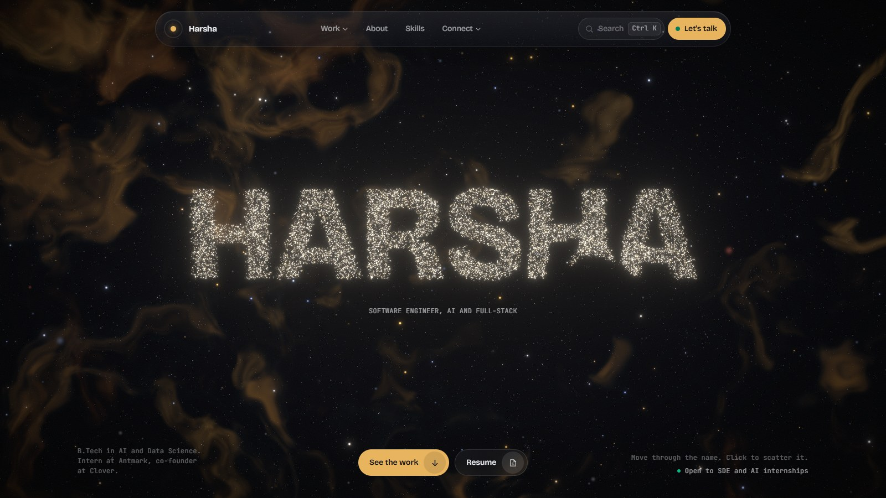
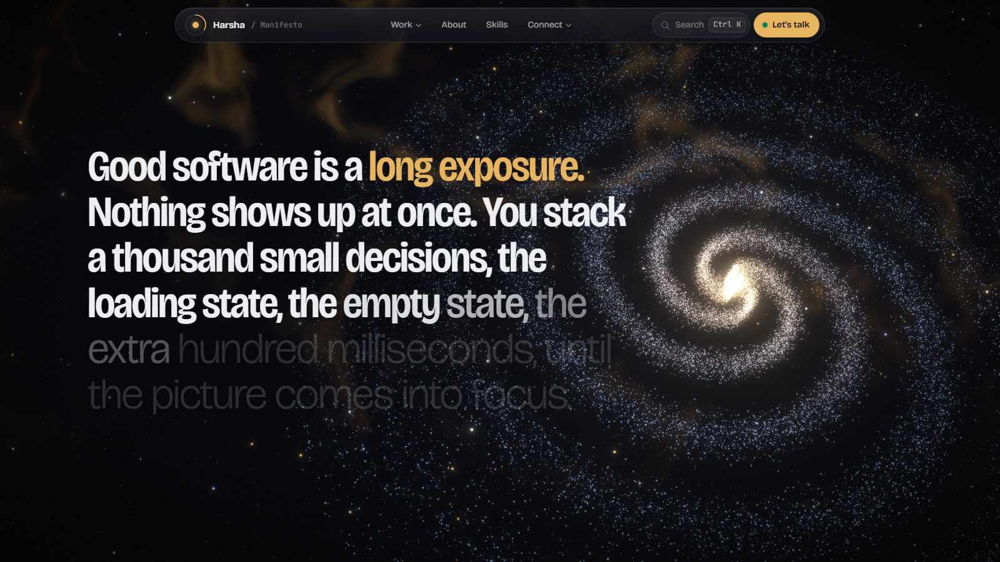
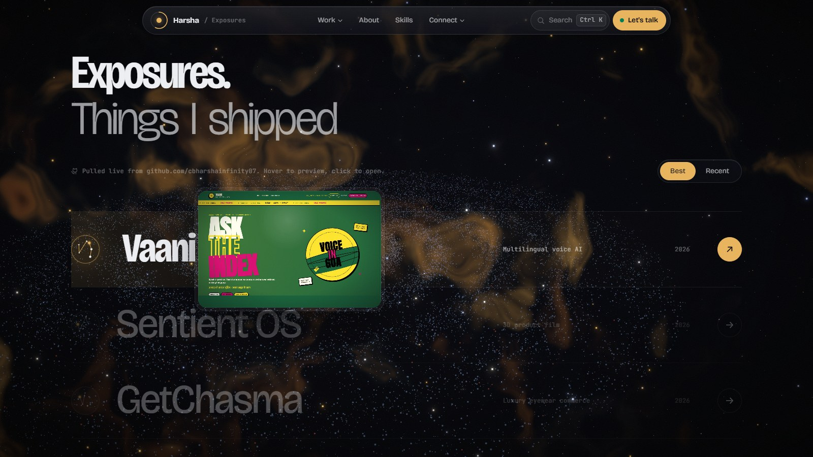
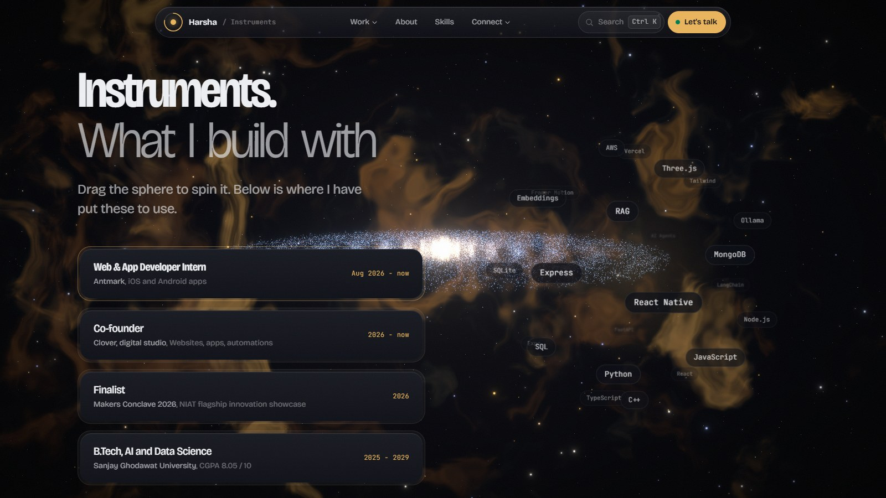
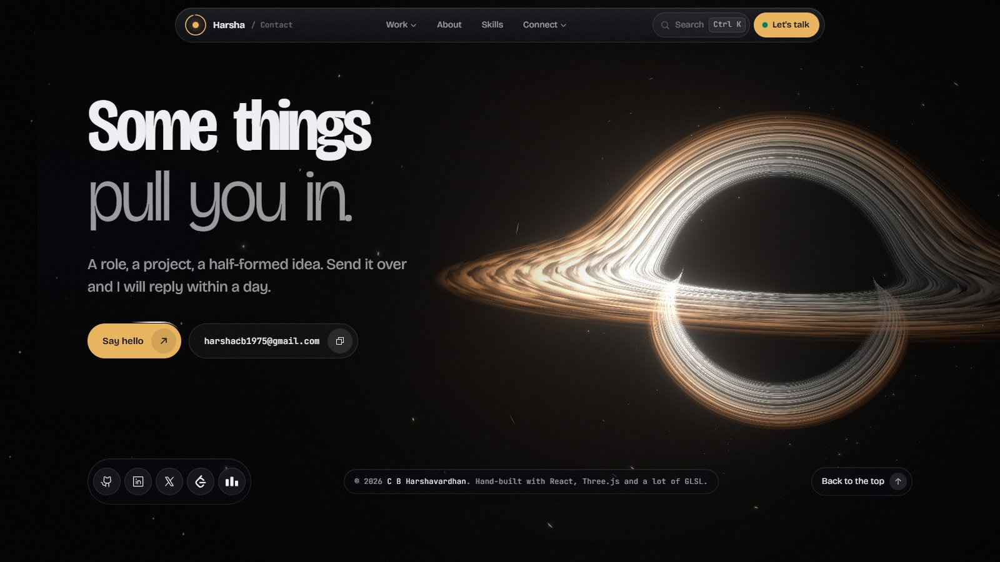

<a href="https://cbharsha.vercel.app">
  
</a>

<h1 align="center">Deep Field</h1>

<p align="center">
  <b>The portfolio of C B Harshavardhan.</b><br/>
  A name drawn in 26,000 particles unravels into a spiral galaxy, drifts past the work,<br/>and ends at a ray-traced black hole.
</p>

<p align="center">
  <a href="https://cbharsha.vercel.app"></a>
</p>

<p align="center">
  
  
  
  
  
  
  
</p>

<p align="center">
  <a href="https://cbharsha.vercel.app">Live site</a> &nbsp;·&nbsp;
  <a href="https://www.linkedin.com/in/c-b-harshavardhan-97a2b8375/">LinkedIn</a> &nbsp;·&nbsp;
  <a href="https://github.com/cbharshainfinity07">GitHub</a> &nbsp;·&nbsp;
  <a href="https://leetcode.com/u/cbharshainfinity07/">LeetCode</a> &nbsp;·&nbsp;
  <a href="https://codeforces.com/profile/cbharshainfinity07">Codeforces</a> &nbsp;·&nbsp;
  <a href="https://x.com/cbhinfinity0202">X</a>
</p>

<br/>

## The idea

Good software is a long exposure. Nothing shows up at once; you stack a thousand small decisions until the picture comes into focus. This site is built the same way: one continuous scene, every section a stage of the same night sky, and every detail tuned until it felt right.

## The journey, in five acts

<table>
  <tr>
    <td width="50%"></td>
    <td width="50%"></td>
  </tr>
  <tr>
    <td><b>1. The name.</b> 26,000 particles fall out of the dark and form <code>HARSHA</code>. They part around your cursor like gas around a probe; click and they burst.</td>
    <td><b>2. The galaxy.</b> On scroll, the same particles unravel into a three-armed spiral with differential rotation, while the manifesto develops word by word on the font's weight axis.</td>
  </tr>
  <tr>
    <td width="50%"></td>
    <td width="50%"></td>
  </tr>
  <tr>
    <td><b>3. Exposures.</b> A typographic index of real projects pulled from GitHub. Hover: the name condenses, a generated constellation logo draws itself, and a preview follows the cursor, wiping and racking into focus.</td>
    <td><b>4. Instruments.</b> Skills on a draggable 3D sphere with inertia, next to experience in machined double-bezel cards. The galaxy turns edge-on behind.</td>
  </tr>
  <tr>
    <td colspan="2"></td>
  </tr>
  <tr>
    <td colspan="2"><b>5. The black hole.</b> A ray-marched Schwarzschild black hole: light bends around it, the far side of the accretion disk lenses over the top, and the side spinning toward you glows brighter (relativistic beaming). It drifts with your cursor.</td>
  </tr>
</table>

## Details worth noticing

| | |
|---|---|
| **Particle name** | Text rasterised to a canvas, sampled into 26k points, animated entirely on the GPU (intro, cursor repulsion, click burst, galaxy morph) in one vertex shader. |
| **Nebula** | Layered domain-warped fractal noise with dark dust lanes, billboarded at depth for parallax. Narrowband palette: teal, hydrogen gold, rust. |
| **Black hole** | Per-pixel ray march with a Newtonian approximation of Schwarzschild bending, a Doppler-beamed disk and a filmic shoulder so it never clips to white. |
| **Variable type** | Bricolage Grotesque on all three axes (weight, width, optical size). Headings condense in letter by letter and swell near the cursor. |
| **Navigation** | Floating glass island, Stripe-style morphing dropdowns, scroll-progress ring, live section label, and a <kbd>Ctrl</kbd>/<kbd>⌘</kbd> + <kbd>K</kbd> command menu. |
| **Project logos** | Each project gets a constellation mark generated deterministically from its name: unique, but one family. |
| **Performance** | Adaptive resolution (drops on slower GPUs), lazy-loaded 3D chunk, transform/opacity-only DOM motion, no scroll listeners. |
| **Accessibility** | Real text in the DOM behind every visual, keyboard-first menus, visible focus, skip link, and tiered `prefers-reduced-motion` support. |

## Built with

| Layer | Tools |
|---|---|
| App | React 19, TypeScript, Vite |
| 3D | Three.js via React Three Fiber, custom GLSL, postprocessing (bloom, grain, vignette) |
| Motion | GSAP ScrollTrigger, Lenis smooth scroll, Motion (springs, layout) |
| Styling | Tailwind CSS v4, CSS custom properties, registered `@property` for animatable font axes |
| Content | GitHub REST API importer, Phosphor and Simple Icons |
| Hosting | Vercel |

## Run it locally

```bash
npm install
npm run dev        # http://localhost:5173
npm run build      # production build in dist/
```

| Script | What it does |
|---|---|
| `npm run github -- <username>` | Pulls your public repos, ranks them (stars, forks, docs, recency) and writes `src/data/github.json` |
| `npm run shots` | Re-captures the README screenshots from the live site with your installed Edge/Chrome |
| `npx vercel deploy --prod` | Ships to production |

## Make it yours

Everything personal lives in [`src/content.ts`](src/content.ts): name, particle text, links, section copy, experience, skills, and `projectOverrides` for hand-written project titles, blurbs and images.

```
src/
├─ three/SpaceScene.tsx    stars, nebula, particle name → galaxy, dust, black hole, camera path
├─ lib/flight.ts           smooth scroll + scroll "stage" that drives the 3D scene
├─ components/             Hero, Manifesto, Work, Instruments, Contact, Menu, CommandPalette
├─ content.ts              all copy and data
└─ data/github.json        generated by the importer
```

## Credits

Design direction shaped with [Taste Skill](https://www.tasteskill.dev/) and [UI Skills](https://www.ui-skills.com/) (better-ui, accessible-animation, Emil Kowalski's animation principles), with references from [21st.dev](https://21st.dev) and [Best Designs on X](https://bestdesignsonx.com).

<p align="center"><sub>© 2026 C B Harshavardhan</sub></p>
